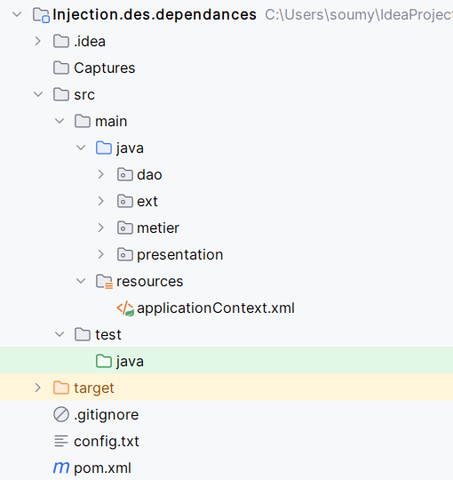
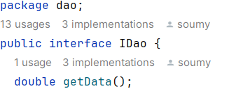
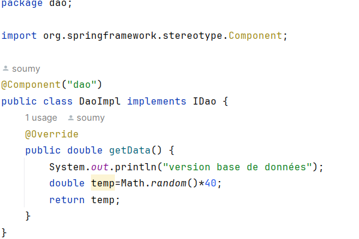
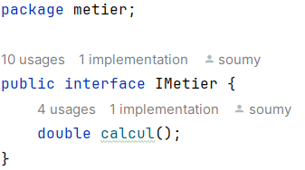
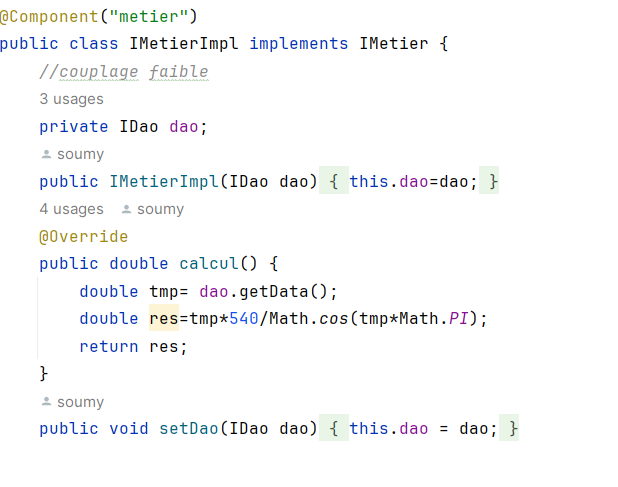
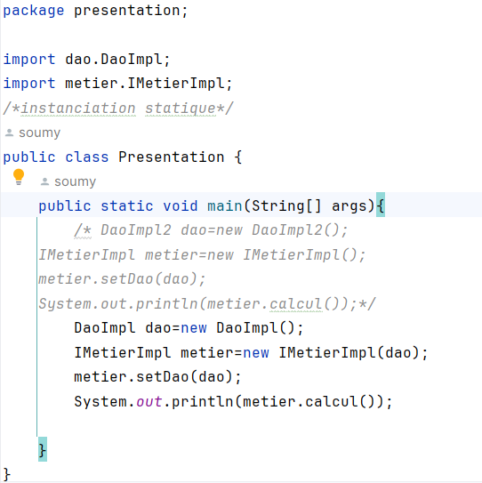
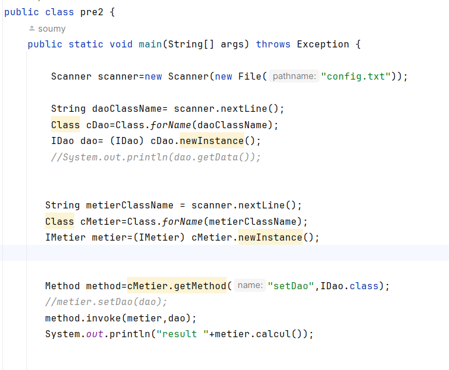
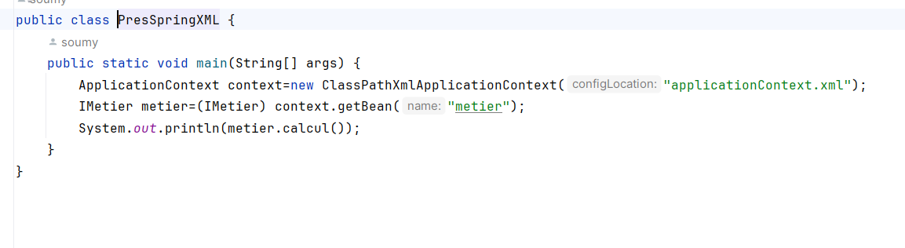
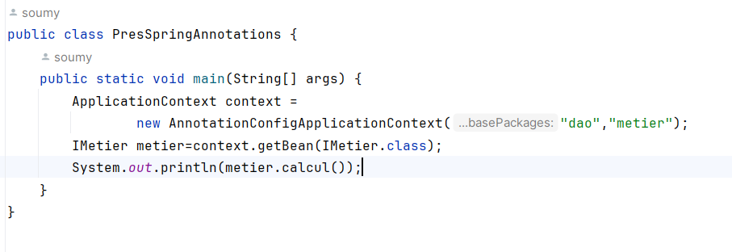

<h2>Compte Rendu </h2>

<h4>Activité Pratique N° 1 - Injection des dépendances</h4>

<h3>Captures d'ecran</h3>

<h6> Architecture du projet </h6>

<h6>  Créer l'interface IDao avec une méthode getDate </h6>

<h6>  Créer une implémentation de cette interface  </h6>

<h6>  Créer l'interface IMetier avec une méthode calcul  </h6>

<h6>Implementation del'interface IMetier en utilisant le couplage faible</h6>

<h6>  Faire l'injection des dépendances :  </h6>

<h6>  a. Par instanciation statique </h6>

<h6>  b. Par instanciation dynamique </h6>

<h6>  c. En utilisant le Framework Spring  </h6>

 <h6>- Version XML</h6>

<h6>- Version annotations</h6> 
